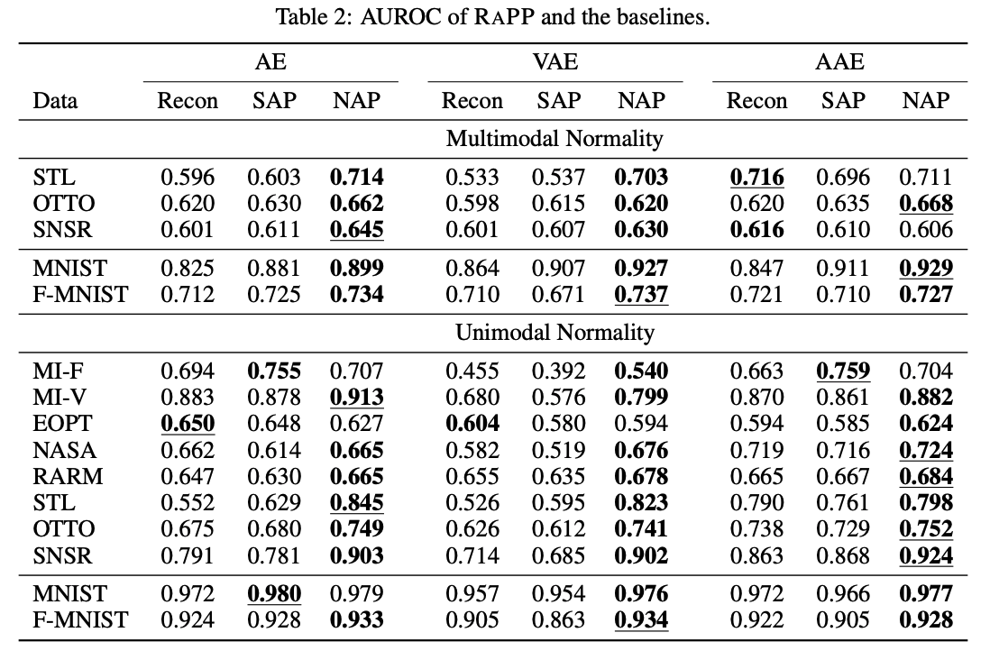
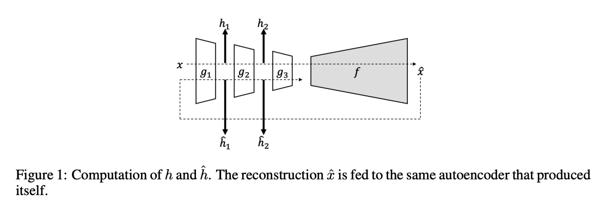

# RaPP
RaPP: Novelty Detection with Reconstruction along Projection Pathway, Ki Hyun Kim, Sangwoo Shim, Yongsub Lim, Jongseob Jeon, Jeongwoo Choi, Byungchan Kim and Andre S. Yoon, ICLR, 2020 [paper](https://openreview.net/forum?id=HkgeGeBYDB)


# Result

Table 2 is the result from paper.

And below is the result of our code.
| model   |    auroc |   sap_auroc |   nap_auroc |
|:--------|---------:|------------:|------------:|
| aae     | 0.862623 |    0.911775 |    **0.916441** |
| ae      | 0.858531 |    0.908304 |    **0.916463** |
| vae     | 0.880025 |    **0.929843** |    0.873222 |

You can see the each experiment result in `assets/runs.csv`


# Usage
## Environment
- python==3.8
- pytorch-lightning==1.2.10
- torch==1.8.1
- torchmetrics==0.2.0
- torchvision==0.9.1
- mlflow==1.15.0
- scikit-learn==0.24.1
```bash
pip install -r requirements.txt
```

## Run
Default run is multimodal setup.
```bash
python src/train.py --target_label 0
```

To run unimodal setup use `--unimodal` argument.
```bash
python src/train.py --target_label 0 --unimodal
```
For more information with argument, see below section.

## Arguments
### dataset
Only conducted experiments with MNIST dataset.


### unimodal
There are two type of using MNIST dataset. 
From paper, explains like below.
> 1. Multimodal Normality: A single class is chosen to be the novelty class and the remaining
classes are assigned as the normal class. This setup is repeated to produce sub-datasets
with all possible novelty assignments. For instance, MNIST results in a set of datasets with
10 different novelty classes.
> 2. Unimodal Normality: In contrast to the multimodal normality setup, we take one class for
normality, and the others for novelty. For instance, MNIST results in a set of datasets with
10 different normal classes

### taget label
Target label differs from multimodal, unimodal setup.
In multimodal setup, target label means unseen label.
On the other hand, in unimodal setup, target label means seen label.

### rapp_start_index & rapp_end_index

From figure 1 in paper, each encoder layer generates score.
We need to decide to use which layer's score.
For example, if encoder has 10 layers length of score should be 10. Below is pseudo code for understand.
```
layer_score = []
for encoder in encoder_layer:
    x = encoder(x)
    recon_x = encoder(recon_x)
    score = (x - recon_x) ** 2
    layer_score.append(score)
```
With given `rapp_start_index` and `rapp_end_index`, we slice the layer_score to get sap_score and nap_score.
```
layer_score = layer_score[rapp_start_index:rapp_end_index]
```
